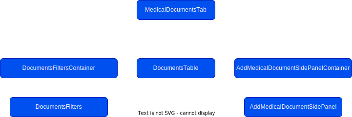

# Medical - Documents Tab

## Overview

The documents tab for medical is responsible for uploading of documents
associated with a athlete/player to `S3`, examples of documents that may be
uploaded include player injury reports, scans, session notes and more. Currently
the documents section uses the annotation framework that the notes tab uses,
this is subject to change in the future. Viewing and adding documents are
currently the only functionality available.

React hooks and `useState` is used widely instead of storing data in `redux` in
the documents tab as the need for accessing documents tab specific data outside
of documents seemed redundant.

The documents tab is available at three different levels with slight variances
and functionality dependent on what level the user is on:

1. **Roster Level** - is the most flexible and has all columns in the documents
   table and also has all the filters, a user can add documents for any
   athlete/player.
2. **Athlete/Player Level** - contains player specific documents and the ability
   to add a document for that athlete only. The athlete/player filter is hidden
   in this view as it is not relevant. In the add document side panel the
   player/athlete selector is disabled and pre selected as the athlete that the
   user is on.
3. **Injury Level** - Injury is more specific than the player/athlete level, the
   table doesn't contain the player/athlete or injury columns as the user has
   drilled down on that specific information. The player selector is disabled
   and preselected with the selected player in the add document side panel at
   this level. The injury is pre selected in the add document side panel but it
   is not disabled as the user may want to add a document associated with this
   injury and others.

**Export Warning Modal** This modal will be shown if the user selects any
invalid file type upon click the 'Export' button.

## Scope for Future Development

- **Archiving Documents** - Currently there is a column in the documents table
  commented out for actions which was originally meant to allow the user to
  archive documents but that development was put on hold until the back end
  development was complete for this.

- **Editing Documents** - We are reusing the AddMedicalDocumentsSidePanel to
  Edit a selected document. the following fields are editable, 'Date of
  Document', 'Category', 'Note', and 'Associated injury/illness'. As for the
  document the only editable portion would be the title. _need
  medical-documents-edit permission_

## Component Tree

## Permissions

All documents permissions fall into the `medical` subset. Future permissions
will be added for `canArchive` and `canEdit`.

| Group       | Permission  |
| ----------- | ----------- |
| `documents` | `canView`   |
| &nbsp;      | `canCreate` |

## Feature Flags

- `medical-documents-view`
- `medical-documents-create`

## People with Context

Cathal Diver _(Frontend)_, Lexie Karkazis _(Frontend)_, DJ Kelmanson
_(Frontend)_, Alessandro Vegna _(Backend)_, Fabrizio Menghini Calderón
_(Backend)_, Pia Kwatra _(Design)_, Nick Cunningham _(Product)_, Jonathan Murphy
_(Product)_
