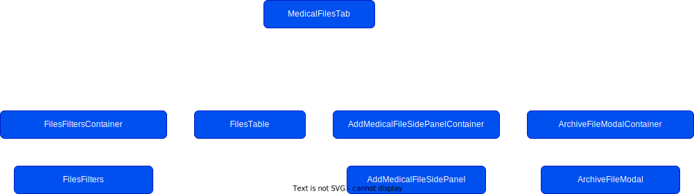

# Medical - Files Tab

## Overview

The files tab for medical is responsible for uploading of files associated with
a athlete/player to `S3`, examples of files that may be uploaded include player
injury reports, scans, session notes and more. Files differs from the Documents
tab based on its usage of the newly developed backend specifically for files.
The old files tab leveraged the annotation framework, this new tab uses a
purpose built set of API's.

React hooks and `useState` is used widely instead of storing data in `redux` in
the files tab as the need for accessing files tab specific data outside of files
seemed redundant.

Currently a user can view, create and archive files dependent on their
permissions

A user can also export these documents to a single pdf. Only images and pdfs are
available for export. A user can NOT export archived documents at the moment.

The files tab is available at three different levels with slight variances and
functionality dependent on what level the user is on:

1. **Roster Level** - is the most flexible and has all columns in the files
   table and also has all the filters, a user can add files for any
   athlete/player.
2. **Athlete/Player Level** - contains player specific files and the ability to
   add a file for that athlete only. The athlete/player filter is hidden in this
   view as it is not relevant. In the add file side panel the player/athlete
   selector is disabled and pre selected as the athlete that the user is on.
3. **Injury Level** - Injury is more specific than the player/athlete level, the
   table doesn't contain the player/athlete or injury columns as the user has
   drilled down on that specific information. The player selector is disabled
   and preselected with the selected player in the add file side panel at this
   level. The injury is pre selected in the add file side panel but it is not
   disabled as the user may want to add a file associated with this injury and
   others.

## Scope for Future Development

- **Editing Documents**

## Component Tree

## Permissions

All files permissions fall into the `medical` subset. Future permissions will be
added for `canEdit`.

| Group    | Permission  |
| -------- | ----------- |
| `files`  | `canView`   |
| &nbsp;   | `canCreate` |
| `issues` | `canExport` |

## Feature Flags

- `medical-documents-files-area`
- `export-multi-doc`

## People with Context

Cathal Diver _(Frontend)_, Lexie Karkazis _(Frontend)_, Joe Leung _(Backend)_,
Darragh O'Brien _(Backend)_, Pia Kwatra _(Design)_, Nick Cunningham _(Product)_,
Jonathan Murphy _(Product)_
