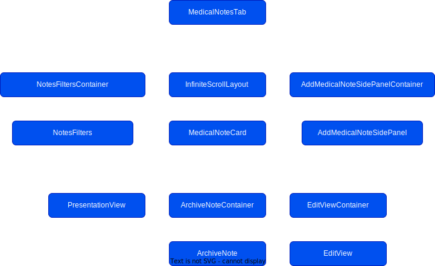

# Medical - Notes Tab

## Overview

The notes tab is responsible for the creating and actioning the notes associated
with an athlete. Actions that can be performed on a note are currently:

- View
- Create
- Edit
- Archive

The notes tab is available at three different levels with slight variances and
functionality dependent on what level the user is on:

1. **Roster Level** - is the most flexible and has all columns in the notes
   table and also has all the filters, a user can add notes for any
   athlete/player.
2. **Athlete/Player Level** - contains player specific notes and the ability to
   add a note for that athlete only. The athlete/player filter is hidden in this
   view as it is not relevant. In the add note side panel the player/athlete
   selector is disabled and pre selected as the athlete that the user is on.
3. **Injury Level** - Injury is more specific than the player/athlete level, the
   table doesn't contain the player/athlete or injury columns as the user has
   drilled down on that specific information. The player selector is disabled
   and preselected with the selected player in the add note side panel at this
   level. The injury is pre selected in the add note side panel but it is not
   disabled as the user may want to add a note associated with this injury and
   others.

The user also has the ability to add a note on the initial tab at all 3 levels
using the `Add` menu.

### Technical Details

A mixture of `React Hooks` and `Redux` is used widely throughout the notes tab
where applicable to manage the application state throughout its component tree.
Where `React Hooks`, specifically `useState`, is not applicable because of prop
drilling, use `redux`.

## Scope for Future Development

Currently we are not passing the `squad_id` as part of our create request, this
is causing a bug where sometimes notes are associated with the correct athlete
but the incorrect squad. The solution for this is currently being worked on.

## Component Tree

## Permissions

All notes permissions fall into the `medical` subset.

| Group   | Permission   |
| ------- | ------------ |
| `notes` | `canView`    |
| &nbsp;  | `canCreate`  |
| &nbsp;  | `canEdit`    |
| &nbsp;  | `canArchive` |

## Feature Flags

- `rehab-note`
- `medical-note-inherit-name`
- `mls-emr-psych-notes`

## People with Context

Cathal Diver _(Frontend)_, Emmett Daly _(Frontend)_, Alessandro Vegna
(Backend)_, Fabrizio Menghini Calderón _(Backend)_, Pia Kwatra _(Design)_, Nick
Cunningham _(Product)_, Jonathan Murphy _(Product)\_
